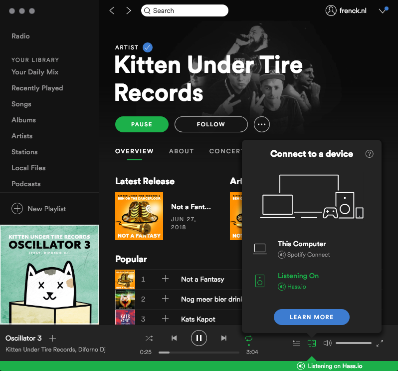

# Home Assistant Community Add-on: Spotify Connect

[![GitHub Release][releases-shield]][releases]
![Project Stage][project-stage-shield]
[![License][license-shield]](LICENSE.md)

![Supports aarch64 Architecture][aarch64-shield]
![Supports amd64 Architecture][amd64-shield]

[![Github Actions][github-actions-shield]][github-actions]
![Project Maintenance][maintenance-shield]
[![GitHub Activity][commits-shield]][commits]

[![Discord][discord-shield]][discord]
[![Community Forum][forum-shield]][forum]

[![Sponsor Frenck via GitHub Sponsors][github-sponsors-shield]][github-sponsors]

[![Support Frenck on Patreon][patreon-shield]][patreon]

Play Spotify music on your Home Assistant device.

## About

The Home Assistant Spotify Connect add-on allows you to use your device,
running Home Assistant, to play your Spotify music. This add-on uses the
Spotify Connect protocol, which makes it a device that can be controlled
by all the official clients.

For example; Running Home Assistant on a Raspberry Pi with this add-on
installed will allow you to play your Spotify music on the Pi. So all you'll
have to do is hook up your sound system to the Pi and start booming!

[:books: Read the full add-on documentation][docs]

## Support

Got questions?

You have several options to get them answered:

- The [Home Assistant Community Add-ons Discord chat server][discord] for add-on
  support and feature requests.
- The [Home Assistant Discord chat server][discord-ha] for general Home
  Assistant discussions and questions.
- The Home Assistant [Community Forum][forum].
- Join the [Reddit subreddit][reddit] in [/r/homeassistant][reddit]

You could also [open an issue here][issue] GitHub.

## Contributing

This is an active open-source project. We are always open to people who want to
use the code or contribute to it.

We have set up a separate document containing our
[contribution guidelines](.github/CONTRIBUTING.md).

Thank you for being involved! :heart_eyes:

## Authors & contributors

The original setup of this repository is by [Franck Nijhof][frenck].

For a full list of all authors and contributors,
check [the contributor's page][contributors].

## We have got some Home Assistant add-ons for you

Want some more functionality to your Home Assistant instance?

We have created multiple add-ons for Home Assistant. For a full list, check out
our [GitHub Repository][repository].

## License

MIT License

Copyright (c) 2018-2025 Franck Nijhof

Permission is hereby granted, free of charge, to any person obtaining a copy
of this software and associated documentation files (the "Software"), to deal
in the Software without restriction, including without limitation the rights
to use, copy, modify, merge, publish, distribute, sublicense, and/or sell
copies of the Software, and to permit persons to whom the Software is
furnished to do so, subject to the following conditions:

The above copyright notice and this permission notice shall be included in all
copies or substantial portions of the Software.

THE SOFTWARE IS PROVIDED "AS IS", WITHOUT WARRANTY OF ANY KIND, EXPRESS OR
IMPLIED, INCLUDING BUT NOT LIMITED TO THE WARRANTIES OF MERCHANTABILITY,
FITNESS FOR A PARTICULAR PURPOSE AND NONINFRINGEMENT. IN NO EVENT SHALL THE
AUTHORS OR COPYRIGHT HOLDERS BE LIABLE FOR ANY CLAIM, DAMAGES OR OTHER
LIABILITY, WHETHER IN AN ACTION OF CONTRACT, TORT OR OTHERWISE, ARISING FROM,
OUT OF OR IN CONNECTION WITH THE SOFTWARE OR THE USE OR OTHER DEALINGS IN THE
SOFTWARE.

[aarch64-shield]: https://img.shields.io/badge/aarch64-yes-green.svg
[amd64-shield]: https://img.shields.io/badge/amd64-yes-green.svg
[commits-shield]: https://img.shields.io/github/commit-activity/y/hassio-addons/addon-spotify-connect.svg
[commits]: https://github.com/hassio-addons/addon-spotify-connect/commits/main
[contributors]: https://github.com/hassio-addons/addon-spotify-connect/graphs/contributors
[discord-ha]: https://discord.gg/c5DvZ4e
[discord-shield]: https://img.shields.io/discord/478094546522079232.svg
[discord]: https://discord.me/hassioaddons
[docs]: https://github.com/hassio-addons/addon-spotify-connect/blob/main/spotify/DOCS.md
[forum-shield]: https://img.shields.io/badge/community-forum-brightgreen.svg
[forum]: https://community.home-assistant.io/t/home-assistant-community-add-on-spotify-connect/61210?u=frenck
[frenck]: https://github.com/frenck
[github-actions-shield]: https://github.com/hassio-addons/addon-spotify-connect/workflows/CI/badge.svg
[github-actions]: https://github.com/hassio-addons/addon-spotify-connect/actions
[github-sponsors-shield]: https://frenck.dev/wp-content/uploads/2019/12/github_sponsor.png
[github-sponsors]: https://github.com/sponsors/frenck
[issue]: https://github.com/hassio-addons/addon-spotify-connect/issues
[license-shield]: https://img.shields.io/github/license/hassio-addons/addon-spotify-connect.svg
[maintenance-shield]: https://img.shields.io/maintenance/yes/2025.svg
[patreon-shield]: https://frenck.dev/wp-content/uploads/2019/12/patreon.png
[patreon]: https://www.patreon.com/frenck
[project-stage-shield]: https://img.shields.io/badge/project%20stage-experimental-yellow.svg
[reddit]: https://reddit.com/r/homeassistant
[releases-shield]: https://img.shields.io/github/release/hassio-addons/addon-spotify-connect.svg
[releases]: https://github.com/hassio-addons/addon-spotify-connect/releases
[repository]: https://github.com/hassio-addons/repository
